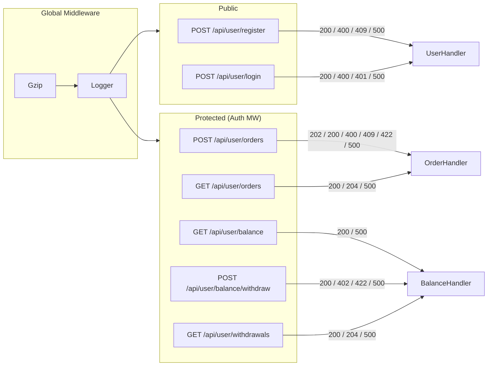
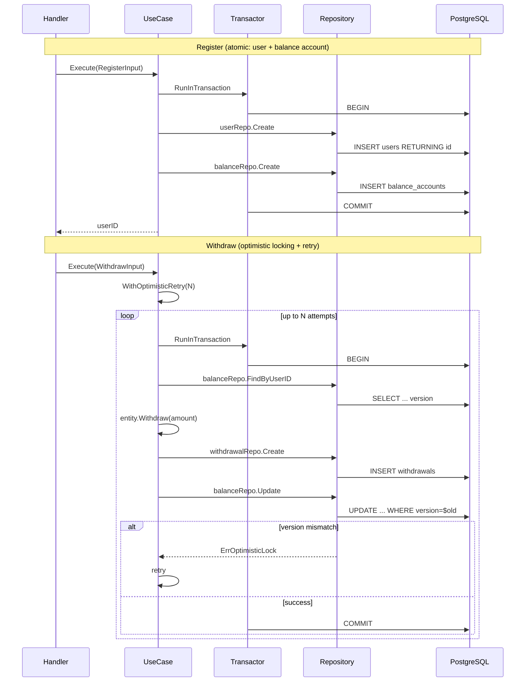
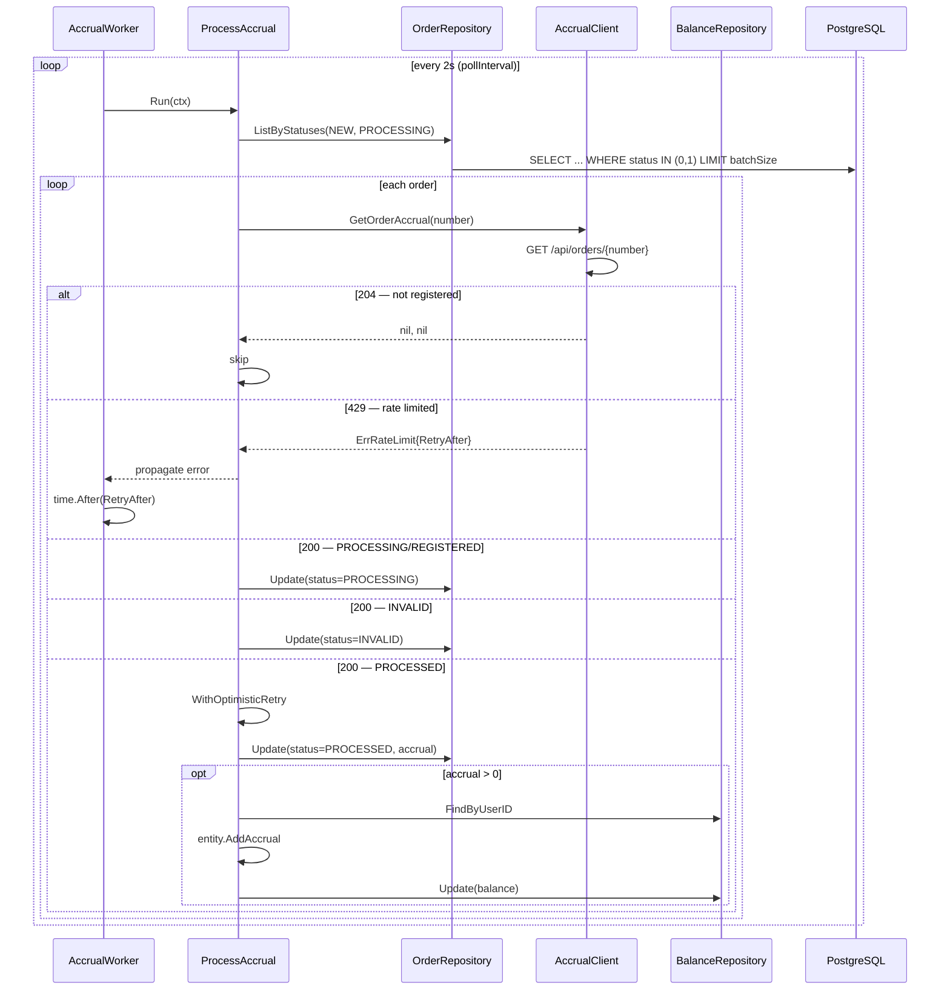
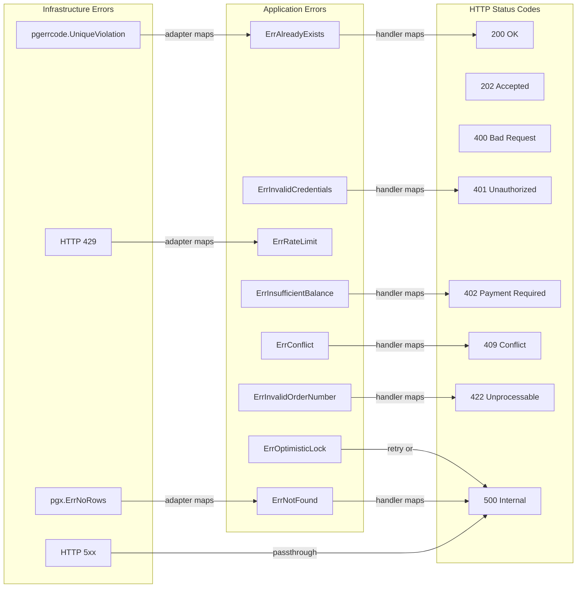
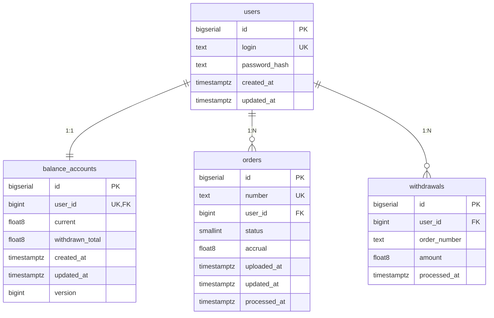

# Gophermart — Architecture Overview

## Project Structure

```
cmd/gophermart/
├── main.go                          # Entry point
└── bootstrap/
    ├── bootstrap.go                 # Run — loads config, logger, DB, migrations, starts app
    ├── app.go                       # NewApp — Composition Root (wires all dependencies)
    ├── factory.go                   # UseCaseFactory implementation
    ├── router.go                    # NewRouter — Gin engine, routes, middleware
    ├── server.go                    # StartServer, WaitForShutdown (graceful)
    ├── postgres.go                  # NewPool — pgxpool.Pool from config
    └── migrate.go                   # RunMigrations — golang-migrate

internal/gophermart/
├── config/
│   ├── config.go                    # Config, LoadConfig (flags + env)
│   └── types.go                     # Address, Duration, BCryptCost custom types
│
├── domain/
│   ├── entity/
│   │   ├── user.go                  # User
│   │   ├── order.go                 # Order, OrderStatus (NEW/PROCESSING/INVALID/PROCESSED)
│   │   ├── balance_account.go       # BalanceAccount (AddAccrual, Withdraw, Version)
│   │   └── withdrawal.go           # Withdrawal
│   ├── vo/
│   │   ├── user_id.go              # UserID
│   │   ├── order_number.go         # OrderNumber + NewOrderNumber
│   │   ├── order_number_validator.go # OrderNumberValidator interface
│   │   ├── points.go               # Points
│   │   └── errors.go               # ErrInvalidOrderNumber
│   └── service/
│       ├── user.go                  # UserService.CreateUser
│       ├── order.go                 # OrderService.CreateOrder
│       ├── balance.go               # BalanceService.CreateAccount
│       └── withdrawal.go           # WithdrawalService.CreateWithdrawal
│
├── application/
│   ├── errors.go                    # Application errors (ErrAlreadyExists, ErrNotFound, etc.)
│   ├── retry.go                     # WithOptimisticRetry helper
│   ├── port/
│   │   ├── usecase.go              # UseCase[In,Out], BackgroundRunner interfaces
│   │   ├── user_repository.go      # UserReader, UserWriter, UserRepository
│   │   ├── order_repository.go     # OrderReader, OrderWriter, OrderRepository
│   │   ├── balance_repository.go   # BalanceAccountReader, Writer, Repository
│   │   ├── withdrawal_repository.go # WithdrawalReader, Writer, Repository
│   │   ├── transactor.go           # Transactor interface
│   │   ├── accrual_client.go       # AccrualClient interface
│   │   ├── token_provider.go       # TokenProvider interface
│   │   ├── password_hasher.go      # PasswordHasher interface
│   │   └── logger.go               # Logger interface
│   ├── dto/
│   │   ├── user.go                 # RegisterInput, LoginInput
│   │   ├── order.go                # UploadOrderInput, OrderOutput
│   │   ├── balance.go              # BalanceOutput
│   │   ├── withdrawal.go           # WithdrawInput, WithdrawalOutput
│   │   └── accrual.go              # AccrualOrderInfo
│   └── usecase/
│       ├── register.go             # RegisterUser (user + balance in TX)
│       ├── login.go                # LoginUser
│       ├── upload_order.go         # UploadOrder (Luhn + conflict check)
│       ├── list_orders.go          # ListOrders
│       ├── get_balance.go          # GetBalance
│       ├── withdraw.go             # Withdraw (optimistic lock + retry)
│       ├── list_withdrawals.go     # ListWithdrawals
│       └── process_accrual.go      # ProcessAccrual (background polling)
│
├── adapters/
│   ├── repository/postgres/
│   │   ├── user.go                 # UserRepository impl
│   │   ├── order.go                # OrderRepository impl (status int<->enum mapping)
│   │   ├── balance.go              # BalanceAccountRepository impl (optimistic lock)
│   │   ├── withdrawal.go           # WithdrawalRepository impl
│   │   ├── transactor.go           # Transactor impl (pgx TX management)
│   │   ├── querier.go              # Querier interface (pool or TX)
│   │   ├── retry.go                # DoWithRetry, RetryConfig, IsRetriable
│   │   └── errors.go               # mapPgError helper
│   ├── accrual/
│   │   └── client.go               # HTTP AccrualClient impl (200/204/429 handling)
│   ├── auth/
│   │   ├── jwt_provider.go         # JWTProvider impl
│   │   └── bcrypt_hasher.go        # BCryptHasher impl
│   ├── logger/
│   │   ├── zap.go                  # ZapLogger impl
│   │   └── nop.go                  # NopLogger (tests)
│   └── validation/
│       └── luhn.go                 # LuhnValidator impl
│
└── presentation/
    ├── http/
    │   ├── handler/
    │   │   ├── user.go             # UserHandler (Register, Login)
    │   │   ├── order.go            # OrderHandler (Upload, List)
    │   │   └── balance.go          # BalanceHandler (Get, Withdraw, ListWithdrawals)
    │   ├── dto/
    │   │   ├── user.go             # RegisterRequest, LoginRequest (+ easyjson)
    │   │   ├── order.go            # OrderResponse (+ easyjson)
    │   │   ├── balance.go          # BalanceResponse (+ easyjson)
    │   │   └── withdrawal.go       # WithdrawRequest, WithdrawalResponse (+ easyjson)
    │   ├── middleware/
    │   │   ├── auth.go             # Auth middleware + BearerTokenExtractor
    │   │   ├── compression.go      # Gzip middleware (sync.Pool)
    │   │   └── logger.go           # Request logging middleware
    │   └── httpcontext/
    │       └── user.go             # UserID() context helper
    ├── worker/
    │   └── accrual.go              # AccrualWorker (background polling, rate limit backoff)
    └── factory/
        └── usecase_factory.go      # UseCaseFactory interface

internal/shared/luhn/
└── luhn.go                          # Luhn algorithm (shared utility)

migrations/gophermart/
├── 000000_create_users              # users table
├── 000001_create_balance_accounts   # balance_accounts table (version column)
├── 000002_create_orders             # orders table (composite index)
├── 000003_create_withdrawals        # withdrawals table
└── 000004_add_updated_at_triggers   # set_updated_at() function + triggers
```

## Dependency Rule (Clean Architecture)

```mermaid
graph TD
    subgraph infrastructure ["Infrastructure — cmd/gophermart/bootstrap"]
        Bootstrap["Run()"]
        NewApp["NewApp() — Composition Root"]
        Router["NewRouter()"]
        FactoryImpl["useCaseFactory"]
        PgPool["pgxpool.Pool"]
        Migrator["golang-migrate"]
        Server["HTTP Server"]
    end

    subgraph presentation ["Presentation — presentation/ (driving adapters)"]
        subgraph handlers [HTTP Handlers]
            UserHandler["UserHandler"]
            OrderHandler["OrderHandler"]
            BalanceHandler["BalanceHandler"]
        end
        subgraph middleware [Middleware]
            AuthMW["Auth"]
            CompressMW["Gzip"]
            LoggerMW["Logger"]
        end
        Worker["AccrualWorker"]
        FactoryIface["UseCaseFactory interface"]
        HTTPDto["HTTP DTOs + easyjson"]
    end

    subgraph application ["Application — application/"]
        subgraph usecases [Use Cases]
            Register["RegisterUser"]
            Login["LoginUser"]
            UploadOrder["UploadOrder"]
            ListOrders["ListOrders"]
            GetBalance["GetBalance"]
            WithdrawUC["Withdraw"]
            ListWithdrawals["ListWithdrawals"]
            ProcessAccrual["ProcessAccrual"]
        end
        subgraph appDto [Application DTOs]
            AppDTOs["RegisterInput, OrderOutput, ..."]
        end
        AppErrors["errors.go + retry.go"]
    end

    subgraph ports ["Application Ports — application/port"]
        UserRepo["UserReader / UserWriter"]
        OrderRepo["OrderReader / OrderWriter"]
        BalanceRepo["BalanceAccountReader / Writer"]
        WithdrawalRepo["WithdrawalReader / Writer"]
        AccrualClient["AccrualClient"]
        Transactor["Transactor"]
        BackgroundRunner["BackgroundRunner"]
        TokenProvider["TokenProvider"]
        PasswordHasher["PasswordHasher"]
        Logger["Logger"]
    end

    subgraph domain ["Domain — domain/"]
        subgraph entities [Entities]
            User["User"]
            Order["Order + OrderStatus"]
            BalanceAccount["BalanceAccount + Version"]
            Withdrawal["Withdrawal"]
        end
        subgraph valueObjects [Value Objects]
            OrderNumber["OrderNumber"]
            Points["Points"]
            UserID["UserID"]
            Validator["OrderNumberValidator"]
        end
        subgraph services [Domain Services]
            UserSvc["UserService"]
            OrderSvc["OrderService"]
            BalanceSvc["BalanceService"]
            WithdrawalSvc["WithdrawalService"]
        end
    end

    subgraph adapters ["Adapters — adapters/ (driven adapters)"]
        subgraph pgRepos [PostgreSQL]
            PgUser["UserRepository"]
            PgOrder["OrderRepository"]
            PgBalance["BalanceAccountRepository"]
            PgWithdrawal["WithdrawalRepository"]
            PgTransactor["Transactor + Querier"]
            PgRetry["DoWithRetry"]
            PgErrors["mapPgError"]
        end
        subgraph external [External]
            AccrualHTTP["accrual.Client"]
        end
        subgraph authAdapters [Auth]
            BCrypt["BCryptHasher"]
            JWT["JWTProvider"]
        end
        subgraph infra [Infra]
            ZapLogger["ZapLogger"]
            Luhn["LuhnValidator"]
        end
    end

    %% Infrastructure wiring
    Bootstrap --> NewApp
    NewApp --> FactoryImpl
    NewApp --> Router
    NewApp --> Server
    Router --> handlers
    Router --> middleware

    %% Presentation -> Application
    handlers -->|"calls via factory"| usecases
    Worker -->|"polls"| ProcessAccrual

    %% Application -> Ports (Dependency Inversion)
    usecases -->|"depends on"| ports
    usecases -->|"uses"| domain

    %% Adapters implement Ports
    PgUser -.->|implements| UserRepo
    PgOrder -.->|implements| OrderRepo
    PgBalance -.->|implements| BalanceRepo
    PgWithdrawal -.->|implements| WithdrawalRepo
    PgTransactor -.->|implements| Transactor
    AccrualHTTP -.->|implements| AccrualClient
    BCrypt -.->|implements| PasswordHasher
    JWT -.->|implements| TokenProvider
    ZapLogger -.->|implements| Logger
    Luhn -.->|implements| Validator

    %% Infrastructure -> Adapters
    PgTransactor --> PgPool
    PgRetry --> PgTransactor
```



## Driving vs Driven Adapters

```mermaid
graph LR
    subgraph driving ["Driving (Primary) — presentation/"]
        direction TB
        H["HTTP Handlers"]
        W["AccrualWorker"]
        MW["Middleware"]
    end

    subgraph core ["Core"]
        direction TB
        UC["Use Cases"]
        P["Ports"]
        D["Domain"]
    end

    subgraph driven ["Driven (Secondary) — adapters/"]
        direction TB
        PG["PostgreSQL Repos"]
        AC["Accrual HTTP Client"]
        AU["JWT + BCrypt"]
        LG["ZapLogger"]
        LH["LuhnValidator"]
    end

    driving -->|"initiates"| core
    core -->|"calls via ports"| driven
```



## HTTP Routes



## Transaction & Concurrency Flows



## Accrual Worker Flow



## Error Mapping Strategy



## Database Schema


