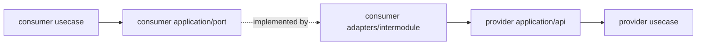
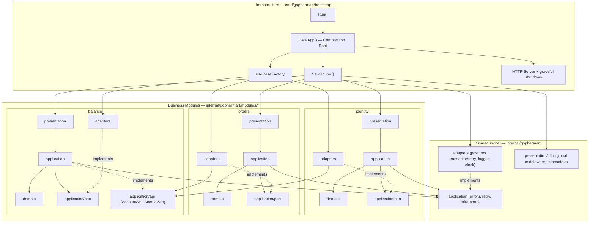
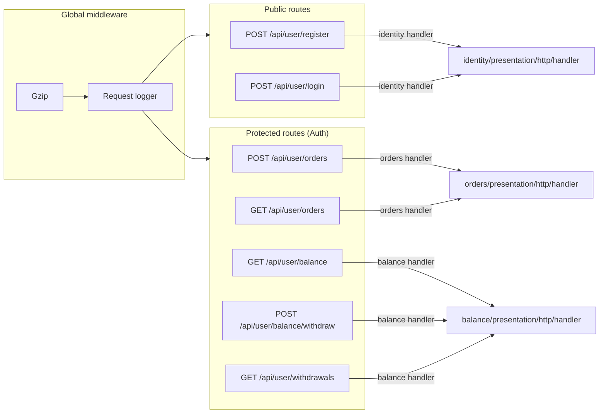
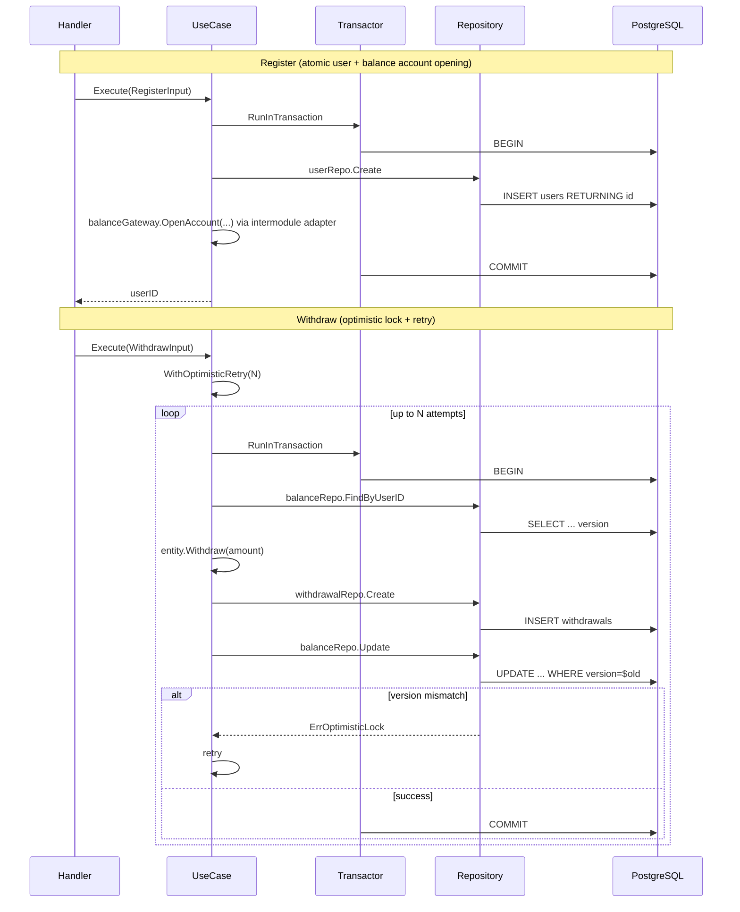
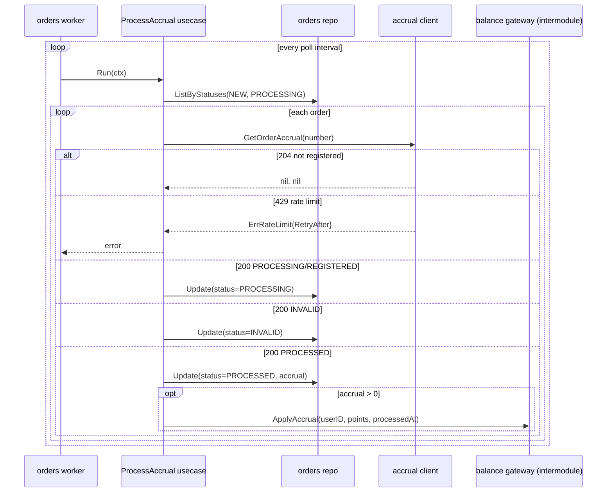
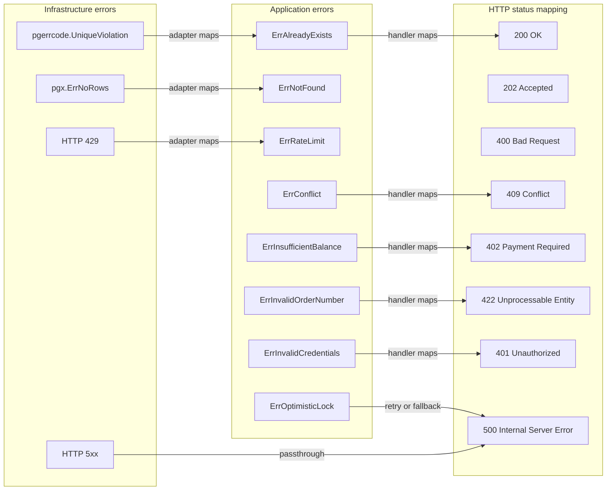
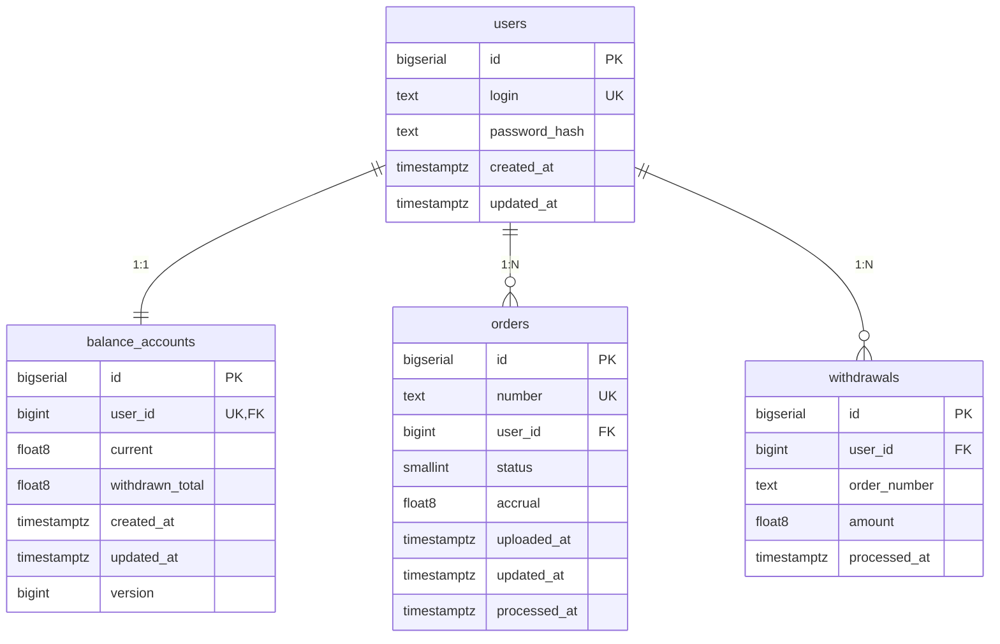

# GopherMart — Architecture

## Architectural Style

Проект реализован как **модульный монолит** в стиле **Clean Architecture** (вертикальная модульность):

- бизнес разделен на вертикальные модули `identity`, `orders`, `balance`;
- внутри каждого модуля соблюдены слои `presentation/adapters -> application -> domain`;
- инфраструктура подключается через порты (Dependency Inversion);
- межмодульные зависимости оформлены через явные контракты.

## Core Principles

1. **Dependency Rule**: внутренние слои не зависят от внешних.
2. **Module Ownership**: доменные сущности, VO, use cases и repository-порты принадлежат модулю-владельцу.
3. **Intermodule Through Contracts Only**:
   - provider публикует контракт в `modules/<provider>/application/api`;
   - consumer объявляет свой порт в `modules/<consumer>/application/port`;
   - consumer реализует адаптер в `modules/<consumer>/adapters/intermodule`;
   - wiring выполняется в `cmd/gophermart/bootstrap/factory.go`.
4. **Thin Composition Root**: `bootstrap` только собирает граф зависимостей, не содержит бизнес-логики.
5. **Shared Kernel Minimalism**: в shared остаются только общие инфраструктурные абстракции и утилиты.

## Project Layout

```text
app/
├── cmd/
│   ├── gophermart/
│   │   ├── main.go
│   │   └── bootstrap/
│   │       ├── bootstrap.go      # Load config, init logger/db, start app
│   │       ├── app.go            # Composition root for adapters/use cases/router/workers
│   │       ├── factory.go        # Unified UseCaseFactory + intermodule wiring
│   │       ├── router.go         # Global middleware + module routers
│   │       ├── server.go         # Start + graceful shutdown
│   │       └── migrate.go        # Goose migrations runner
│   └── migrate/main.go
│
├── internal/gophermart/
│   ├── config/                   # viper + pflag config loading and validation
│   ├── application/              # shared: errors, retry, generic infra ports
│   ├── adapters/                 # shared infra adapters (logger, clock, pg transactor/retry)
│   ├── presentation/             # shared HTTP middleware/httpcontext
│   └── modules/
│       ├── identity/
│       ├── orders/
│       └── balance/
│
├── tests/
│   ├── contract/                 # intermodule contract tests
│   └── e2e/                      # end-to-end API tests
│
└── migrations/gophermart/
```

## Module Internal Structure

Каждый модуль использует одинаковую вертикальную схему:

```text
modules/<module>/
├── domain/
│   ├── entity/
│   ├── vo/
│   └── service/
├── application/
│   ├── dto/
│   ├── port/
│   ├── usecase/
│   ├── factory/
│   └── api/              # только если модуль публикует контракт другим модулям
├── adapters/
│   ├── repository/postgres/
│   ├── intermodule/
│   └── ...               # module-specific adapters (auth/accrual/validation)
└── presentation/
    ├── http/{router,handler,dto}
    ├── worker/
    └── factory/
```

## Module Responsibilities

- `identity`
  - регистрация и аутентификация пользователя;
  - выдача/проверка токенов;
  - при регистрации вызывает API модуля `balance` для открытия счета.

- `orders`
  - загрузка и выдача заказов;
  - фоновая обработка accrual-статусов;
  - при подтвержденном начислении вызывает API модуля `balance`.

- `balance`
  - баланс, списания, история списаний;
  - предоставляет межмодульные контракты:
    - `application/api/account.go` (`AccountAPI`);
    - `application/api/accrual.go` (`AccrualAPI`).

## Intermodule Communication

Текущие межмодульные связи:

1. `identity -> balance`
   - consumer port: `modules/identity/application/port/balance_gateway.go`
   - consumer adapter: `modules/identity/adapters/intermodule/balance_gateway.go`
   - provider API: `modules/balance/application/api/account.go`

2. `orders -> balance`
   - consumer port: `modules/orders/application/port/balance_gateway.go`
   - consumer adapter: `modules/orders/adapters/intermodule/balance_gateway.go`
   - provider API: `modules/balance/application/api/accrual.go`


```mermaid
graph LR
    ConsumerUC["consumer usecase"]
    ConsumerPort["consumer application/port"]
    ConsumerAdapter["consumer adapters/intermodule"]
    ProviderAPI["provider application/api"]
    ProviderUC["provider usecase"]

    ConsumerUC --> ConsumerPort
    ConsumerPort -.implemented by.-> ConsumerAdapter
    ConsumerAdapter --> ProviderAPI
    ProviderAPI --> ProviderUC
```

## Composition Root (`bootstrap`)

`cmd/gophermart/bootstrap` выполняет:

1. загрузку и валидацию конфигурации;
2. инициализацию shared-adapters (logger, pg pool/transactor, clock);
3. создание module-specific adapters (repositories, JWT/bcrypt, accrual client, validators);
4. сборку единой `UseCaseFactory`;
5. регистрацию роутов и middleware;
6. запуск background workers;
7. graceful shutdown.

В `factory.go` связи модулей задаются явно:

- сначала создаются use cases модуля `balance`;
- затем `identity` и `orders` получают intermodule adapters к API `balance`.

## HTTP Composition

- глобальные middleware: `Recovery`, `Compress`, `Logger`;
- protected middleware: `Auth` (через нейтральный `middleware.TokenValidator`);
- public routes: `register`, `login`;
- protected routes: `orders`, `balance`, `withdrawals`.

## Shared Kernel

В `internal/gophermart/application` расположены только cross-module элементы:

- `errors.go` (общие application-ошибки);
- `retry.go` (optimistic retry helper);
- инфраструктурные порты `usecase`, `transactor`, `logger`, `clock`, `password_hasher`.

Shared adapters в `internal/gophermart/adapters`:

- `repository/postgres`: transactor, retry, querier, error mapping, config, integration tests;
- `logger`: zap/nop;
- `clock`: real clock.

## Configuration Model

`config.LoadConfig()` собирает конфигурацию в фиксированном приоритете:

1. flags
2. env
3. yaml
4. defaults

Поддерживаются:

- автоматическая загрузка `app/.env` или `.env` (если файл найден);
- fail-fast на обязательных секретах (`DATABASE_URI`, `JWT_SECRET`);
- startup logging эффективной конфигурации без раскрытия секретов.

## Testing Strategy

### Unit Tests

- расположены рядом с кодом модулей;
- фокус: use cases, domain logic, handlers, adapters.

### Integration Tests (`//go:build integration`)

- `internal/gophermart/adapters/repository/postgres/repository_integration_test.go`;
- тестируют реальные операции с PostgreSQL.

### Contract Tests

- `app/tests/contract/balance_account_contract_test.go`;
- `app/tests/contract/balance_accrual_contract_test.go`;
- проверяют совместимость consumer-adapter <-> provider API контрактов.

### E2E Tests (`//go:build integration`)

- `app/tests/e2e/api_test.go`;
- проверяют полный HTTP-поток через реальный router/bootstrap wiring.

## Dependency Rule (Clean Architecture)


```mermaid
graph TD
    subgraph infrastructure ["Infrastructure — cmd/gophermart/bootstrap"]
        Bootstrap["Run()"]
        NewApp["NewApp() — Composition Root"]
        Router["NewRouter()"]
        FactoryImpl["useCaseFactory"]
        Server["HTTP Server + graceful shutdown"]
    end

    subgraph modules ["Business Modules — internal/gophermart/modules/*"]
        subgraph identity ["identity"]
            I_P["presentation"]
            I_A["application"]
            I_D["domain"]
            I_PORT["application/port"]
            I_AD["adapters"]
        end
        subgraph orders ["orders"]
            O_P["presentation"]
            O_A["application"]
            O_D["domain"]
            O_PORT["application/port"]
            O_AD["adapters"]
        end
        subgraph balance ["balance"]
            B_P["presentation"]
            B_A["application"]
            B_D["domain"]
            B_PORT["application/port"]
            B_AD["adapters"]
            B_API["application/api (AccountAPI, AccrualAPI)"]
        end
    end

    subgraph shared ["Shared kernel — internal/gophermart"]
        AppShared["application (errors, retry, infra ports)"]
        AdaptersShared["adapters (postgres transactor/retry, logger, clock)"]
        HttpShared["presentation/http (global middleware, httpcontext)"]
    end

    %% bootstrap wiring
    Bootstrap --> NewApp
    NewApp --> FactoryImpl
    NewApp --> Router
    NewApp --> Server
    Router --> HttpShared
    Router --> I_P
    Router --> O_P
    Router --> B_P

    %% module internal dependency rule
    I_P --> I_A --> I_D
    O_P --> O_A --> O_D
    B_P --> B_A --> B_D

    %% application depends on ports (not on adapters)
    I_A --> I_PORT
    O_A --> O_PORT
    B_A --> B_PORT
    I_A --> AppShared
    O_A --> AppShared
    B_A --> AppShared

    %% adapters implement module/shared ports
    I_AD -.implements.-> I_PORT
    O_AD -.implements.-> O_PORT
    B_AD -.implements.-> B_PORT
    AdaptersShared -.implements.-> AppShared

    %% provider API is implemented by balance application
    B_A -.implements.-> B_API

    %% intermodule runtime calls go through adapters to provider API
    I_AD --> B_API
    O_AD --> B_API

    %% composition root wires concrete adapters
    FactoryImpl --> I_AD
    FactoryImpl --> O_AD
    FactoryImpl --> B_AD
    FactoryImpl --> AdaptersShared
```

## Driving vs Driven Adapters


```mermaid
graph LR
    subgraph driving ["Driving adapters"]
        direction TB
        H["HTTP handlers (module presentation/http/handler)"]
        W["Workers (module presentation/worker)"]
        MW["Global middleware (shared presentation/http/middleware)"]
    end

    subgraph core ["Core"]
        direction TB
        UC["Use cases (module application/usecase)"]
        P["Ports (module/shared application/port)"]
        D["Domain (module domain/entity+vo+service)"]
    end

    subgraph driven ["Driven adapters"]
        direction TB
        PG["PostgreSQL repos (module adapters/repository/postgres)"]
        TR["Shared transactor/retry (shared adapters/repository/postgres)"]
        AC["Accrual HTTP client (orders/adapters/accrual)"]
        AU["JWT + BCrypt (identity/adapters/auth)"]
        LG["Zap logger + clock (shared adapters)"]
        IM["Intermodule adapters (module adapters/intermodule)"]
    end

    driving -->|"initiates"| core
    core -->|"calls via ports"| driven
```

## HTTP Routes


```mermaid
graph LR
    subgraph global ["Global middleware"]
        Gzip["Gzip"]
        Log["Request logger"]
    end

    subgraph public ["Public routes"]
        POST_Register["POST /api/user/register"]
        POST_Login["POST /api/user/login"]
    end

    subgraph protected ["Protected routes (Auth)"]
        POST_Orders["POST /api/user/orders"]
        GET_Orders["GET /api/user/orders"]
        GET_Balance["GET /api/user/balance"]
        POST_Withdraw["POST /api/user/balance/withdraw"]
        GET_Withdrawals["GET /api/user/withdrawals"]
    end

    Gzip --> Log
    Log --> public
    Log --> protected

    POST_Register -->|"identity handler"| IdentityH["identity/presentation/http/handler"]
    POST_Login -->|"identity handler"| IdentityH
    POST_Orders -->|"orders handler"| OrdersH["orders/presentation/http/handler"]
    GET_Orders -->|"orders handler"| OrdersH
    GET_Balance -->|"balance handler"| BalanceH["balance/presentation/http/handler"]
    POST_Withdraw -->|"balance handler"| BalanceH
    GET_Withdrawals -->|"balance handler"| BalanceH
```

## Transaction & Concurrency Flows


```mermaid
sequenceDiagram
    participant H as Handler
    participant UC as UseCase
    participant TX as Transactor
    participant R as Repository
    participant DB as PostgreSQL

    Note over H,DB: Register (atomic user + balance account opening)
    H->>UC: Execute(RegisterInput)
    UC->>TX: RunInTransaction
    TX->>DB: BEGIN
    UC->>R: userRepo.Create
    R->>DB: INSERT users RETURNING id
    UC->>UC: balanceGateway.OpenAccount(...) via intermodule adapter
    TX->>DB: COMMIT
    UC-->>H: userID

    Note over H,DB: Withdraw (optimistic lock + retry)
    H->>UC: Execute(WithdrawInput)
    UC->>UC: WithOptimisticRetry(N)
    loop up to N attempts
        UC->>TX: RunInTransaction
        TX->>DB: BEGIN
        UC->>R: balanceRepo.FindByUserID
        R->>DB: SELECT ... version
        UC->>UC: entity.Withdraw(amount)
        UC->>R: withdrawalRepo.Create
        R->>DB: INSERT withdrawals
        UC->>R: balanceRepo.Update
        R->>DB: UPDATE ... WHERE version=$old
        alt version mismatch
            R-->>UC: ErrOptimisticLock
            UC->>UC: retry
        else success
            TX->>DB: COMMIT
        end
    end
```

## Accrual Worker Flow


```mermaid
sequenceDiagram
    participant W as orders worker
    participant UC as ProcessAccrual usecase
    participant OR as orders repo
    participant AC as accrual client
    participant BG as balance gateway (intermodule)

    loop every poll interval
        W->>UC: Run(ctx)
        UC->>OR: ListByStatuses(NEW, PROCESSING)
        loop each order
            UC->>AC: GetOrderAccrual(number)
            alt 204 not registered
                AC-->>UC: nil, nil
            else 429 rate limit
                AC-->>UC: ErrRateLimit{RetryAfter}
                UC-->>W: error
            else 200 PROCESSING/REGISTERED
                UC->>OR: Update(status=PROCESSING)
            else 200 INVALID
                UC->>OR: Update(status=INVALID)
            else 200 PROCESSED
                UC->>OR: Update(status=PROCESSED, accrual)
                opt accrual > 0
                    UC->>BG: ApplyAccrual(userID, points, processedAt)
                end
            end
        end
    end
```

## Error Mapping Strategy


```mermaid
graph LR
    subgraph infra ["Infrastructure errors"]
        PgErr["pgerrcode.UniqueViolation"]
        PgNoRows["pgx.ErrNoRows"]
        Http429["HTTP 429"]
        HttpOther["HTTP 5xx"]
    end

    subgraph app ["Application errors"]
        AlreadyExists["ErrAlreadyExists"]
        NotFound["ErrNotFound"]
        RateLimit["ErrRateLimit"]
        Conflict["ErrConflict"]
        InsufficientBalance["ErrInsufficientBalance"]
        InvalidOrder["ErrInvalidOrderNumber"]
        InvalidCreds["ErrInvalidCredentials"]
        OptLock["ErrOptimisticLock"]
    end

    subgraph http ["HTTP status mapping"]
        S200["200 OK"]
        S202["202 Accepted"]
        S400["400 Bad Request"]
        S401["401 Unauthorized"]
        S402["402 Payment Required"]
        S409["409 Conflict"]
        S422["422 Unprocessable Entity"]
        S500["500 Internal Server Error"]
    end

    PgErr -->|"adapter maps"| AlreadyExists
    PgNoRows -->|"adapter maps"| NotFound
    Http429 -->|"adapter maps"| RateLimit
    HttpOther -->|"passthrough"| S500

    AlreadyExists -->|"handler maps"| S200
    Conflict -->|"handler maps"| S409
    InvalidOrder -->|"handler maps"| S422
    InvalidCreds -->|"handler maps"| S401
    InsufficientBalance -->|"handler maps"| S402
    OptLock -->|"retry or fallback"| S500
```

## Database Schema


```mermaid
erDiagram
    users {
        bigserial id PK
        text login UK
        text password_hash
        timestamptz created_at
        timestamptz updated_at
    }

    balance_accounts {
        bigserial id PK
        bigint user_id UK,FK
        float8 current
        float8 withdrawn_total
        timestamptz created_at
        timestamptz updated_at
        bigint version
    }

    orders {
        bigserial id PK
        text number UK
        bigint user_id FK
        smallint status
        float8 accrual
        timestamptz uploaded_at
        timestamptz updated_at
        timestamptz processed_at
    }

    withdrawals {
        bigserial id PK
        bigint user_id FK
        text order_number
        float8 amount
        timestamptz processed_at
    }

    users ||--|| balance_accounts : "1:1"
    users ||--o{ orders : "1:N"
    users ||--o{ withdrawals : "1:N"
```

## Practical Rules for New Code

1. Новая бизнес-фича сначала помещается в конкретный модуль.
2. Межмодульный вызов создается только через `application/api` + `adapters/intermodule`.
3. Repository interface объявляется в модуле-владельце агрегата.
4. `bootstrap` не содержит бизнес-правил, только wiring.
5. Shared-пакеты расширяются только для truly cross-cutting concerns.
